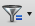
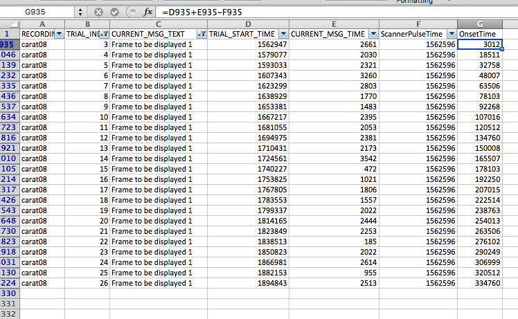
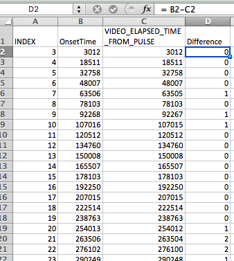

# Spot-Checking Timing Files

There are two ways that we can figure out when trials were presented.   

1. **User-defined variables**: In the CARAT Experiment-Builder script, there are some variables that have been created to determine time from the scanner pulse.  
2. **Raw EDF output**: Since the scanner triggers a keyboard event (`KEYBOARD_SCANNER`), we can use the EDF output to calculate when events happened relative to the beginning of the scan run.

User-defined variables are a lot easier to deal with, but the raw EDF output is less prone to error. So, we should occasionally check to make sure these methods match. First, we need to create output for both methods.

*Note: This spot-checking method can only be done on a single scan run (i.e., SPONT\_1, SPONT\_2, SPR\_1, or SPR\_2) at a time.*

### Output: user-defined variables

1. Open up DataViewer.
2. Import the EDF file you are working with (e.g., SPOINT\_1 for sub08).
3. Create a trial report with the following variables. (Analysis > Reports > Trial Report)
	* `RECORDING_SESSION_LABEL`
	* `INDEX`
	* Any of the user-defined timing variables you are interested in (e.g., `VIDEO_ELAPSED_TIME_FROM_PULSE`)

### Output: raw EDF output

1. Open up DataViewer.
2. Import the EDF file you are working with (e.g., SPOINT\_1 for sub08). **Important**: You must have already added `ScannerPulseTime` as a variable for this EDF or Session file. For more information, see Step 1 of [this](../RawEDFTimings/) documentation.
3. Create a message report with the following variables. (Analysis > Reports > Message Report)
	* `RECORDING_SESSION_LABEL`
	* `TRIAL_INDEX`
	* `CURENT_MSG_TEXT`
	* `TRIAL_START_TIME`
	* `CURRENT_MSG_TIME`
	* `ScannerPulseTime`

### Comparing output

1. Open both of your output files in Excel. 
2. Use the filter  button to filter your raw EDF output by `CURRENT_MSG`
	* Choose the message corresponding to the beginning of the event you want to check. For example, the message corresponding to the beginning of the stimulus presentation is `Frame to be displayed 1`.
3. Calculate the time of that message (e.g., when stimulus presentation began) by adding together `TRIAL_START_TIME` and `CURRENT_MSG_TIME` and subtracting `ScannerPulseTime`.

4. Compare that column to the corresponding column in the user-defined output. You can subtract the two columns to see their difference.

If your results looks like the image above, where the difference is only a millisecond or two for each trial, you are good! The MRI doesn't have millisecond resolution, so that margin of error should not affect your results.

