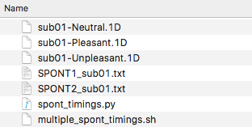
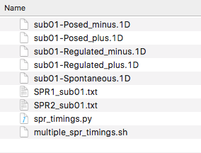

# Creating Timing Files with User-Defined Variables

1. Load your data into DataViewer.
2. Create a Trial Report with the following variables. (Analysis > Reports > Trial Report). *Note: you will have to do this separately for each scan run). You can do it for multiple subjects at a single time, as long as you import them all into the same DataViewer session.*
	* `RECORDING_SESSION_LABEL`
	* `INDEX`
	* `VIDEO_ELAPSED_TIME_FROM_PULSE`
	* `RESPONSE_ELAPSED_TIME_FROM_PULSE`
	* `imagetype`
	* `emotion` (for SPONT runs)
	* `type` (for SPR runs)
3. Save your report with the following format, where `??` is the subject number (e.g., 01, 02, etc.).
	* Spontaneous run 1: `SPONT1_sub??.txt`
	* Spontaneous run 2: `SPONT2_sub??.txt`
	* SPR run 1: `SPR1_sub??.txt`
	* SPR run 2: `SPR2_sub??.txt`
4. Create separate folders for `SPONT` and `SPR`.
5. Copy the `.txt` Trial Reports to their corresponding folders (`SPONT1` AND `SPONT2`  should go to the `SPONT` folder).
6. For each experiment (`SPONT` and `SPR`), there are two scripts that will create your timing files. Copy the scripts into your new `SPONT` and `SPR` files.
	1. `SPONT`: `spont_timings.py` and `multiple_spont_timings.sh`
	2. `SPR` : `spr_timings.py` and `multiple_spr_timings.sh`
7. Navigate (use `cd`) into either the `SPR` or `SPONT` folder. You should have the two script files and all of your trials report files in this folder.
8. Edit line 2 of the `multiple` script. Change `01` to a list of the subjects you would like to create timing files for. 
	* E.g., `01 02 07 14`
9. Save the `multiple` script.
10. Run the `multiple` script.
	* `sh multiple_spont_timings.sh`
	* `sh multiple_spr_timings.sh`  
11. If everything went right, you should end up with some 1D files containing the timing information in the format that AFNI is looking for.

Your SPONT folder should look similar to this:  

  

Your SPR folder should look similar to this:  

