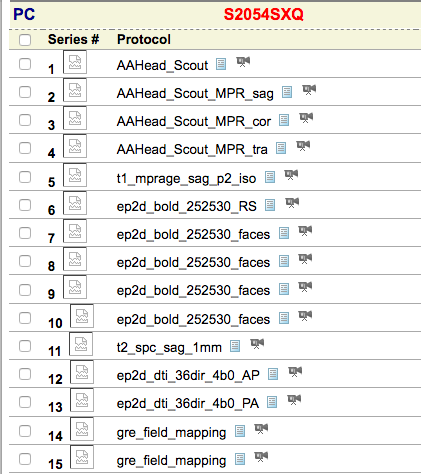

# Preprocessing

Before you start pre-processing, you need to make sure you have all of your data. 

## Gathering & Organizing Data
To preprocess data, you will need [timing files](./create_timing_files.md) and your MRI images.

### MRI Data
All MRI data can be downloaded from the BIRC [Neuroinformatics Database](http://psypacs.psy.uconn.edu/nidb/index.php) (NiDB). Note that you must be on campus or on the [UConn VPN](http://remoteaccess.uconn.edu/) to access the NiDB. To learn more about navigating NiDB, see the [BIRC wiki](http://birc-int.psy.uconn.edu/wiki/index.php/NiDB_User_Guide) (must be on campus or VPN to access).

This section will provide CARAT-specific information about data stored in NiDB. When you search for CARAT data, you will see something like the image below.  
 

Here are the important runs for functional analysis:  

*	**t1\_mprage\_sag\_p2\_iso** (5): T1-weighted anatomical image
*	**ep2d\_bold\_252530\_faces** (7-10): EPI functional images, runs 1-4. Runs 1-2 are SPONT and runs 3-4 are SPR.

Each subject that you download will have separate folders with the Series # as their title. This tells you which folder contains which run of data.

When you select your data to be downloaded from NiDB, use the following options.

* Download Type > Destination: Web
* Data: Imaging, Behavioral, QC
* Format: DICOM, No DICOM anonymization, Gzip files
* Directory Structure > Directory Format: Primary alternate subject ID
* Directory Structure > Series Directories: Renumber series

When you unzip the downloaded file, you will get individual folders for each of the subjects you chose to download. The folders will be labeled with the alternate ID -- this is the subject ID number that Elisa inputs at the beginning of the scan. (e.g., PILOT07CA) Rename this folder to the subject's number with no zero-padding (e.g., 7 instead of 07).

Make sure that the `make_NIFTI_bids.sh` script is in the same parent folder that your data is in. Then run one of the following commands:  

* `sh make_NIFTI_bids.sh X` - replace X with the subject number. Used for just a single subject
* `sh many_bids.sh` - change line 2 to be a list of subjects you want to organize

This step does two things. First, it creates [BIDS](http://bids.neuroimaging.io/) directory structure for your data. Each subject will have a folder with the format `sub-07` and subfolders labeled `spr`, `spont`, and `anat`. Second, this script takes the raw DICOM files downloaded from NiDB and turns them into 4D NIFTI files that can be used by AFNI.

### Timing Files
Make sure to copy the timing files you created previously into the relevant folders. Put the timing files into the BIDS-format folders created earlier (`spont` and `spr`).

* SPONT timing files
	* Pleasant
	* Unpleasant
	* Neutral 	
* SPR timing files
	* Posed_minusUnpleasant
	* Posed_plusPleasant
	* Regulated_minusUnpleasant
	* Regulated_plusPleasant
	* SpontaneousNeutral
	* SpontaneousPleasant
	* SpontanousUnpleasant

## Generating Preprocessing Scripts

In this step, we will generate the preprocessing scripts you will need to actually preprocess your data. The scripts were originally made using `uber_subject.py` from AFNI and then modified by me. These scripts will generate preprocessing scripts and put them in each subject's folder. You can either run the generation scripts individually, or use the batch generation script.

**Running Individually**: Use if you just want to preprocess one subject.  

1. Check your top directory (line 10). This should point to the folder containing all your BIDS-formatted data directories.
2. Run the following command: `sh create_afni_proc.sh 07` -- replace `07` with the subject you want to preprocess.

**Batch Preprocessing**: Use if you want to preprocess multiple subjects.  

1. Check the top directory (line 10 of `create_afni_proc.sh` as described above.
2. Change line 2 of `multiple_afni_proc.sh` to a list of the subjects you want to preprocess, separated by a space.
3. Run the following command: `sh multiple_afni_proc.sh`